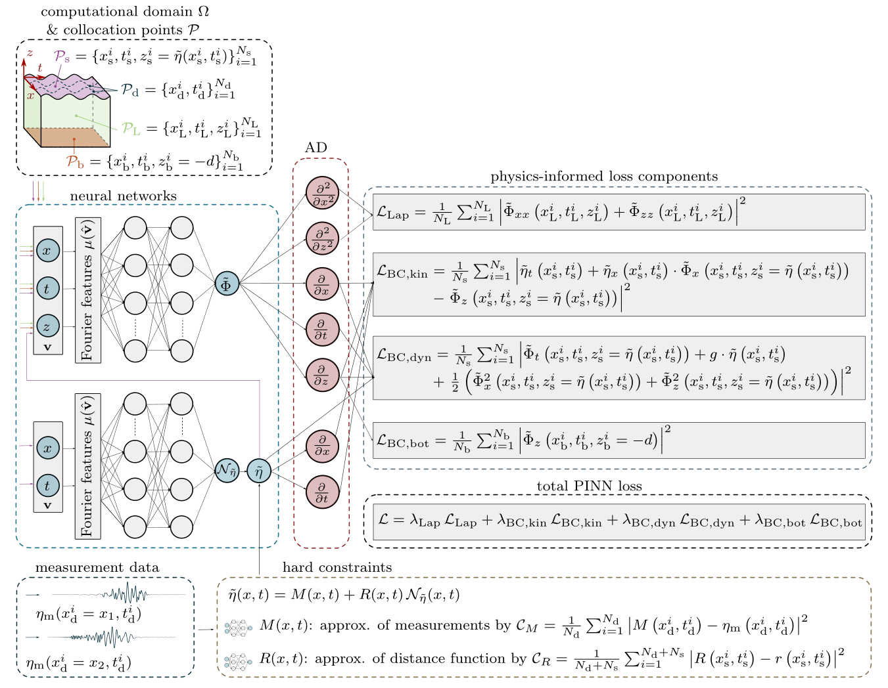

# Physics-Informed Neural Networks for Nonlinear Ocean Waves

This repository contains code related to the paper "Physics-informed neural networks for phase-resolved data assimilation and prediction of nonlinear ocean waves" by Ehlers et al. (2025). The paper explores the use of Physics-Informed Neural Networks (PINNs) to solve the potential flow equations for modeling nonlinear ocean waves, enabling data assimilation and prediction from sparse measurements.

**Key Features:**

*   **PINN Solver for Potential Flow Theory:** Implements a PINN framework to approximate solutions to the potential flow equations governing ocean wave dynamics.
*   **Data Assimilation:** Demonstrates the ability to reconstruct spatio-temporal wave fields from sparse measurements by incorporating physical constraints.
*   **Nonlinear Wave Prediction:** Accurately captures and predicts irregular, nonlinear, and dispersive wave surface dynamics.
*   **Velocity Potential Inference:** Enables the inference of the fully nonlinear velocity potential throughout the fluid volume from surface elevation measurements.
*   **Code Example for Sec. VA1:** This repository provides a code example specifically for the setup and results presented in Section VA1 of the paper, showcasing the PINN implementation for a specific test case.

**Paper Abstract:**

The assimilation and prediction of phase-resolved surface gravity waves are critical challenges in ocean science and engineering. Potential flow theory (PFT) has been widely employed to develop wave models and numerical techniques for wave prediction. However, traditional wave prediction methods are often limited. For example, most simplified wave models have a limited ability to capture strong wave nonlinearity, while fully nonlinear PFT solvers often fail to meet the speed requirements of engineering applications. This computational inefficiency also hinders the development of effective data assimilation techniques, which are required to reconstruct spatial wave information from sparse measurements to initialize the wave prediction.
To address these challenges, we propose a novel solver method that leverages physics-informed neural networks (PINNs) that parameterize PFT solutions as neural networks. This provides a computationally inexpensive way to assimilate and predict wave data. The proposed PINN framework is validated through comparisons with analytical linear PFT solutions and experimental data collected in a laboratory wave flume. The results demonstrate that our approach accurately captures and predicts irregular, nonlinear, and dispersive wave surface dynamics. Moreover, the PINN can infer the fully nonlinear velocity potential throughout the entire fluid volume solely from surface elevation measurements, enabling the calculation of fluid velocities that are difficult to measure experimentally.

**DOI:** [10.48550/arXiv.2501.08430](https://doi.org/10.48550/arXiv.2501.08430) preprint v1

